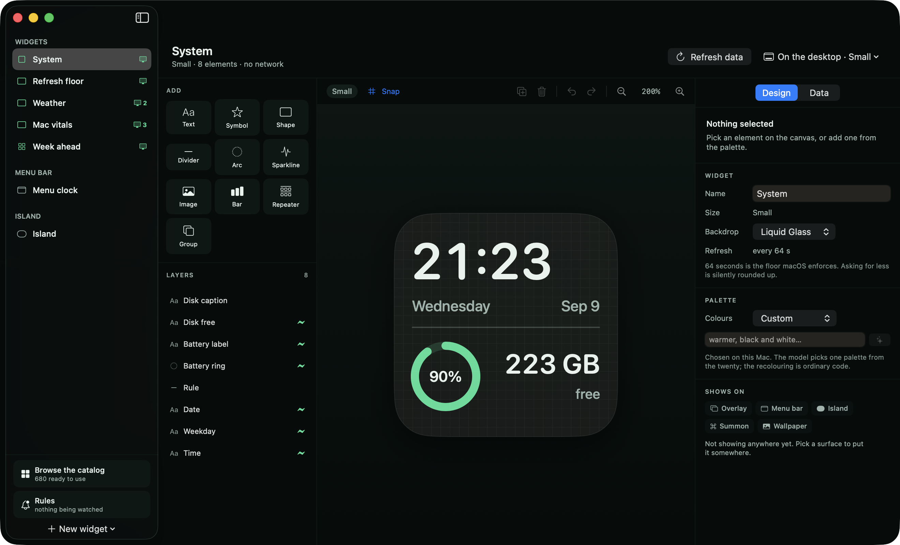
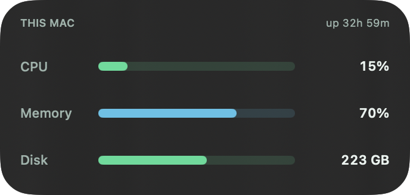
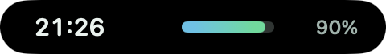
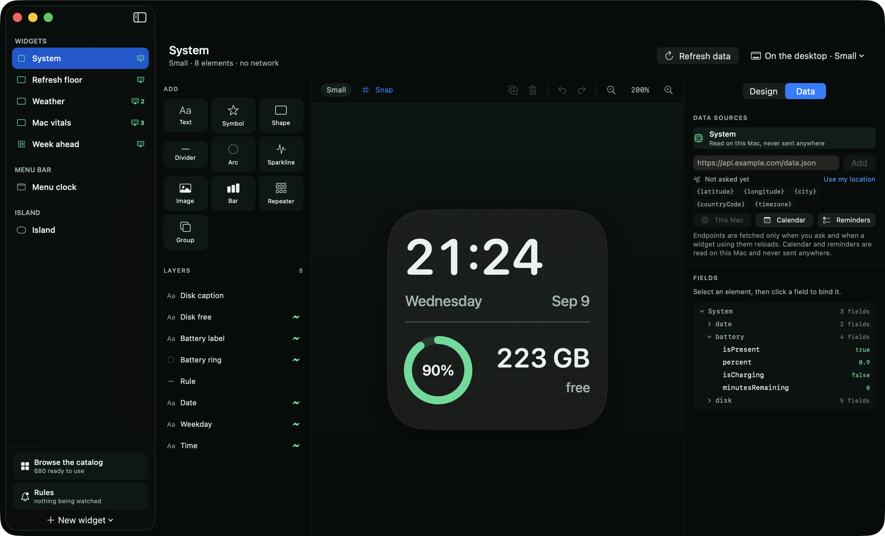
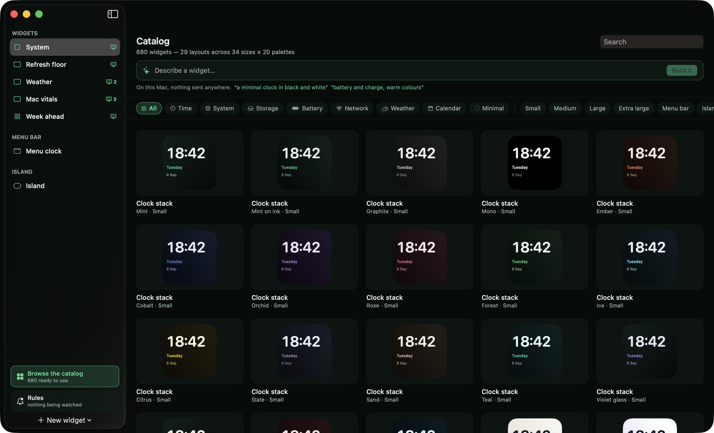

# Fathom

**Build your own Mac widgets.** Design one, bind it to live data, and put it
wherever you like — the desktop, the menu bar, under the notch, behind a hotkey,
or into the wallpaper itself.

Free forever. Every feature. No paid tier, no accounts, no telemetry.



---

## Contents

- [Why this exists](#why-this-exists)
- [Install](#install)
- [Your first five minutes](#your-first-five-minutes)
- [The six places a design can live](#the-six-places-a-design-can-live)
- [Designing](#designing)
- [Live data](#live-data)
- [Expressions](#expressions)
- [The catalogue](#the-catalogue)
- [Writing a widget in words](#writing-a-widget-in-words)
- [Rules](#rules)
- [Clicking things](#clicking-things)
- [Sharing a design](#sharing-a-design)
- [Every feature](#every-feature)
- [What to expect](#what-to-expect)
- [Building from source](#building-from-source)
- [Licence](#licence)

---

## Why this exists

iOS gives a widget roughly 40–70 timeline reloads a day. That budget is why
every iOS widget builder shows data that is hours old, and it is not their
fault.

**macOS has no equivalent budget.** Measured on a real Mac over hundreds of
reloads: a flat 64-second floor, with no decay and no daily cap. A Mac widget
can show data that is at most a minute old, indefinitely.

Fathom is what that finding is for. And the floor only applies to real WidgetKit
widgets — the other five surfaces are windows Fathom draws itself, and they
refresh as often as you ask.

---

## Install

Fathom is not notarised. Notarisation needs Apple's $99/year programme, and
Fathom is free, so macOS will refuse to open it the first time.

1. Download **Fathom.zip** from
   [Releases](https://github.com/devShakib015/fathom/releases/latest) and unzip.
2. Move **Fathom.app** to your **Applications** folder.
3. Open it. macOS will refuse, and say it cannot check for malicious software.
4. Open **System Settings ▸ Privacy & Security**, scroll down to Security, and
   click **Open Anyway** next to the message about Fathom.
5. Open it again and confirm.

You only do this once per version.

**Requires macOS 26 (Tahoe) or later.**

### Updates ask for permissions again

macOS ties privacy grants to an app's signature, and an unsigned app gets a new
signature every build. So a new version of Fathom starts over at "not asked" for
location, calendar and reminders. Your designs and settings are untouched —
only the permissions need granting again. There is no way around this without a
paid certificate.

---

## Your first five minutes

1. **Open Fathom.** Seven designs are already there, so there is something to
   look at before you have made anything.
2. **Click *Browse the catalog*** at the bottom of the sidebar. There are 680
   ready-made designs. Pick one you like and choose **Add to my widgets** — it
   becomes yours, and you can change anything about it.
3. **Put it somewhere.** In the **Design** tab, under **Shows on**, pick a
   surface: *Overlay* puts it straight onto your desktop, and is the quickest
   way to see something working.
4. **Change a colour.** Under **Palette**, pick a different one from the menu.
   Every colour in the design moves together.
5. **Change your mind.** Under **From**, click **Revert** to put the design back
   exactly as it shipped. Your name for it is kept, and Revert is undoable like
   anything else.

To put a design in the desktop's own widget area instead, use **Show on
desktop** in the toolbar, then right-click your desktop, choose **Edit
Widgets**, and add a Fathom widget of the matching size.

---

## The six places a design can live

One design format; six surfaces read it. Any design can go on any of them.

| Surface | What it is | Refresh |
|---|---|---|
| **Widget** | A real macOS widget, in Notification Centre or on the desktop | 64 s floor |
| **Overlay** | A window Fathom draws — any size, anywhere, on the desktop or above your apps | 1 s |
| **Menu bar** | A design in the menu bar, 22 points tall | 1 s |
| **Island** | A strip under the notch that appears when the pointer reaches it | 1 s |
| **Summon** | A panel on a global hotkey. Press again, or Escape, to dismiss | 1 s, and nothing at all while hidden |
| **Wallpaper** | Drawn into the desktop picture itself | 30 s |

Only the first is a WidgetKit widget, and only the first is subject to the
64-second floor.

**Overlay** — any size, anywhere, above or below your windows:



**Island** — hidden until the pointer reaches the notch:



### Widget slots

macOS gives every widget kind one identity, so Fathom ships **ten**: four small,
three medium, two large and one extra large. That is how you get more than one
Fathom widget of the same size on screen at once, each showing something
different. The toolbar's **Show on desktop** menu is where you choose which slot
a design occupies.

---

## Designing

Ten drawing primitives, and a design is just an arrangement of them.

| Element | Draws |
|---|---|
| **Text** | Words or a bound value |
| **Symbol** | Any SF Symbol |
| **Shape** | Rectangle, rounded rectangle, capsule or circle |
| **Divider** | A rule |
| **Arc** | A ring or a gauge, with a start angle and a sweep |
| **Sparkline** | A line through a series of numbers |
| **Image** | A picture from a URL |
| **Bar** | A progress bar |
| **Repeater** | Draws its children once per item in a list |
| **Group** | Holds other elements so they move together |

Every element carries a **frame** (position and size, stored as a fraction of
the design so it scales), and a **style**: font family, size, weight, colour,
gradient, opacity, rotation, letter spacing, line limit, corner radius, stroke,
shadow, and content mode.

Backdrops can be **Liquid Glass** (the desktop shows through), a solid colour, a
gradient, or nothing.

**Named fonts** — any font installed on your Mac can be used by name. If you
share a design that names a font the other person does not have, they are told,
and it falls back to the system font rather than failing.

**Conditional visibility** — any element can carry a condition, so it draws only
when that condition is true. "Hide this when it is zero" is one line.

---

## Live data

Add a source in the **Data** tab, then bind an element to a field in it.



| Source | What it gives you | Asks permission |
|---|---|---|
| **This Mac** | 42 fields across ten branches | No |
| **Web endpoint** | Any JSON API, browsable as a tree | No |
| **Calendar** | Your upcoming events | Yes |
| **Reminders** | What is due | Yes |

**This Mac** covers date and time, battery, disk, CPU, memory, network, host
information, connected Bluetooth devices, and your location. CPU and network are
*rates*, worked out by comparing readings between refreshes.

**Web endpoints** are the interesting ones. Paste a URL, and Fathom fetches it
and shows you the response as a tree with the real values in it. Click a field
to bind the selected element to it. Nothing is fetched until you ask, and then
only when a design using it refreshes.

### Location

A URL can contain `{latitude}`, `{longitude}`, `{city}`, `{countryCode}` or
`{timezone}`, filled in when the request is made. That is what makes a shared
weather design about *whoever opened it* rather than about its author.

Coordinates are trimmed to four decimal places — about eleven metres, more than
any weather endpoint uses and less than a record of where you sit. Location is
never asked for until you press the button, is stored on your Mac, and is only
ever sent to the endpoint your own design names.

### Formats

A bound value can be shown as text, a number with a set precision, a percentage,
a date or time, a duration, or a file size — with a prefix and a suffix. Fathom
guesses a sensible format from the field's name and its value when you first
bind it, and you can change it.

---

## Expressions

Any binding can carry an expression, in a small language written for this. The
value at the key path is called `value`.

```
value * 9 / 5 + 32                      convert to Fahrenheit
if(value > 30, "hot", "fine")           choose a word
percent(disk.usedFraction)              82%
bytes(disk.free)                        223 GB
round(avg(daily.temperature_2m_max), 1) the week's average, one decimal
```

**40 functions**, covering arithmetic, comparison, text, lists, dates and
formatting. Inside a repeater, `item`, `index` and `total` refer to the current
row — which is how three elements can describe seven days.

The language is **total**: nothing you can write will fail. Division by zero is
null rather than infinity, a missing field is null rather than an error, and a
malformed expression shows your fallback text instead of breaking the design.

The same language decides conditional visibility, and drives rules.

---

## The catalogue



**680 ready-made designs** — 29 layouts, offered in 34 layout-and-size
combinations, across 20 palettes.
Search them, filter by category, and add any of them to your library with one
click. Everything after that is editable.

A design added from the catalogue remembers where it came from, so **Revert**
puts it back exactly as it shipped, no matter how much you have changed. Your
name for it survives, and the revert itself is undoable.

**Palettes** can be changed at any time from the Palette menu. This is a
recolour, not a rebuild — every edit you have made survives it, and any colour
you picked yourself is left alone.

---

## Writing a widget in words

If your Mac supports Apple Intelligence, you can describe a widget and have one
built:

> *"a minimal clock in black and white"*
> *"battery and charge, warm colours"*

And restyle an existing design the same way — type *"warm desert sunset"* into
the Palette box and the whole design moves to a matching palette.

This runs entirely on your Mac. Nothing you type is sent anywhere, there is no
account, and it costs nothing. The model's job is deliberately small: it chooses
among the layouts and palettes Fathom already has, and every answer is checked
against the catalogue before anything is built. The worst case is a reasonable
widget rather than a broken one.

Everything here works without Apple Intelligence. The picker is the feature; the
sentence box sits on top of it.

---

## Rules

A rule watches a condition and does something when it becomes true.

Rules have their own data sources, so they can watch something no widget
displays. Each has a check interval and a cooldown, so a condition sitting on
its threshold does not fire over and over.

**When it fires, a rule can:** send a notification · show an overlay · hide an
overlay · open a link · play a sound · open an app · reveal a path in Finder ·
run a shortcut.

Notification text accepts expressions in braces, so an alert can carry the
number that caused it:

```
Disk is down to {bytes(disk.free)}
```

---

## Clicking things

On the surfaces Fathom draws itself — overlays, the menu bar, the island and the
summoned panel — an element can be clicked. It can **open a link**, **open an
app**, **show a path in Finder**, **run a shortcut by name**, or **refresh the
design**.

That list is closed on purpose. A Fathom design is made to be shared, and a
format that could carry "run this command" would be a format for mailing people
malware. Every action is something macOS already lets any app ask for, each
hands the decision to the system, and none of them can do anything you could not
do yourself from the Dock.

Real macOS widgets cannot do this — the framework does not allow it — and the
editor says so rather than letting you set an action that silently never runs.

---

## Sharing a design

Designs export as `.fathom` files. Before one is added, Fathom tells the person
receiving it exactly what it will do:

- every endpoint it will contact, by host
- whether it wants calendar or reminders access
- **what happens if they click it**
- any font it names that their Mac does not have
- whether it was written by a newer version of Fathom

A design that contacts nothing, reads nothing personal and does nothing when
clicked is labelled as such. Importing the same file twice gives you two
widgets rather than silently replacing the first.

---

## Every feature

<details>
<summary><b>Surfaces</b></summary>

- Real macOS widgets in ten slots — 4 small, 3 medium, 2 large, 1 extra large
- Desktop overlays, any size and position, above your windows or behind them
- Click-through overlays, adjustable opacity, per-display placement
- Menu bar items, 22 points tall, several at once
- Notch island — always on, or hidden until the pointer reaches the notch
- Island can expand to a second design when the pointer is over it
- Summoned panel on a global hotkey, dismissed by hotkey, Escape or clicking away
- Live wallpaper, positioned in any corner or centred, at any scale
- Wallpaper remembers and restores your previous desktop picture

</details>

<details>
<summary><b>Design</b></summary>

- Ten element kinds: text, symbol, shape, divider, arc, sparkline, image, bar, repeater, group
- Nesting — groups and repeaters hold other elements
- Drag, resize and snap on the canvas; zoom; a layer list
- Fractional frames, so a design scales to any surface
- Font family, size, weight, design, monospaced digits, letter spacing, line limit
- Foreground and fill colours, gradients with an angle, opacity, rotation
- Corner radius, stroke colour and width, shadow radius, colour and offset
- Arc start angle and sweep; content fit or fill for images
- Backdrops: Liquid Glass, colour, gradient, none
- Any installed font by name, with a graceful fallback and a warning when sharing
- Conditional visibility per element
- Undo and redo throughout; duplicate; delete; multi-select

</details>

<details>
<summary><b>Data</b></summary>

- This Mac: 42 fields over date, battery, disk, CPU, memory, network, host, devices and place
- CPU and network as rates, computed between refreshes
- Any JSON endpoint, with a browsable tree of the real response
- Key paths with dots and bracket indexing — `daily.temperature_2m_max[0]`
- Calendar events and reminders
- Location tokens in URLs: `{latitude}` `{longitude}` `{city}` `{countryCode}` `{timezone}`
- Formats: text, number, percent, date, duration, file size, with prefix and suffix
- Format guessed from the field name and value when you bind
- Last-good caching, so a dropped connection shows yesterday's number rather than dashes
- Images fetched and downsampled, with a visible marker when one cannot be loaded

</details>

<details>
<summary><b>Expressions</b></summary>

- 40 functions: arithmetic, comparison, logic, text, lists, dates, formatting
- `value`, and `item` / `index` / `total` inside a repeater
- Total by construction — no expression can fail or crash a design
- Used for bindings, conditional visibility and rule conditions
- Braces inside notification text and link targets

</details>

<details>
<summary><b>Catalogue and AI</b></summary>

- 680 designs: 29 layouts in 34 layout-and-size combinations × 20 palettes
- Search, and filter by category or size
- Add any design to your library, then edit it freely
- Revert to the shipped original at any time, undoably
- Change palette at any time without losing your edits
- On-device widget generation from a description
- On-device restyling from a description
- On-device field suggestions for a pasted endpoint
- Everything works with Apple Intelligence turned off

</details>

<details>
<summary><b>Automation and sharing</b></summary>

- Rules with their own sources, a condition, an interval and a cooldown
- Fire once on change, or repeatedly while true
- Eight rule actions including notifications, overlays, apps and shortcuts
- Five click actions on Fathom-drawn surfaces
- Export and import `.fathom` files
- Full disclosure on import: hosts, permissions, click actions, missing fonts, version

</details>

---

## What to expect

Honest limits, so nothing here is a surprise.

- **Real widgets refresh no faster than every 64 seconds.** That is macOS, not
  Fathom. Asking for less is silently rounded up. The other five surfaces are
  not affected.
- **Updates reset permissions.** Unsigned apps get a new signature each build,
  and macOS ties privacy grants to signatures.
- **Widgets need re-adding after some updates.** macOS occasionally drops
  widgets whose provider changed.
- **A widget cannot be clicked.** Only the surfaces Fathom draws itself can.
- **Wallpaper redraws are capped at 30 seconds**, because each one renders a
  screen-sized image. Use an overlay for anything that ticks.
- **Location, calendar and reminders are opt-in**, asked for only when you press
  the button, and never sent anywhere by Fathom.

---

## Building from source

Needs [XcodeGen](https://github.com/yonaskolb/XcodeGen). `project.yml` is the
source of truth; the `.xcodeproj` is generated and not committed.

```bash
brew install xcodegen
xcodegen generate
xcodebuild -project Fathom.xcodeproj -scheme Fathom -configuration Release \
  -derivedDataPath build \
  CODE_SIGN_IDENTITY="" CODE_SIGNING_REQUIRED=NO CODE_SIGNING_ALLOWED=NO build
./Tools/sign.sh build/Build/Products/Release/Fathom.app
```

Use `Tools/sign.sh` rather than calling `codesign` directly. `codesign --force
--deep --sign -` — the obvious command — replaces the signature and silently
drops every entitlement, including the sandbox the widget extension needs in
order to be registered at all. The app then installs, launches and looks
completely normal, with no widgets available and no error anywhere. The script
signs inside out with the right entitlements and reads the signature back to
prove they survived.

### Tests

```bash
xcodebuild test -project Fathom.xcodeproj -scheme FathomTests -destination 'platform=macOS'
```

151 tests over the interpreter, the expression language, the JSON parser, format
inference, the document format, the element tree, slots, rules, sharing,
location, hotkeys, restyling and provenance — the code where a regression would
be silent rather than loud. A widget that renders a slightly wrong number every
sixty-four seconds tells nobody anything.

They deliberately do not cover signing, sandboxing, permission grants or whether
an extension is registered at all. None of those can be tested from a test
target; they are measured on an installed build.

### How it works

You cannot compile a widget per user — WidgetKit extensions are compiled SwiftUI
and macOS will not load code at runtime. So a Fathom widget is *data*: a
document of positioned elements with styles and bindings, which one universal
extension reads and interprets on every reload.

```
Fathom.app ──writes──▶  /Users/Shared/Fathom/<uid>  ◀──reads── FathomWidget.appex
   editor                    *.fathom (JSON)                  interprets + draws
```

Not an App Group, deliberately. A group is bound to a signing team, and an
unsigned build has no team, so an ad-hoc signed extension resolves the group URL
and is then denied the directory — silently, and only in the shipped build.

---

## Licence

MIT. Every feature, free, forever.

© 2026 K M Shahriar Hossain
